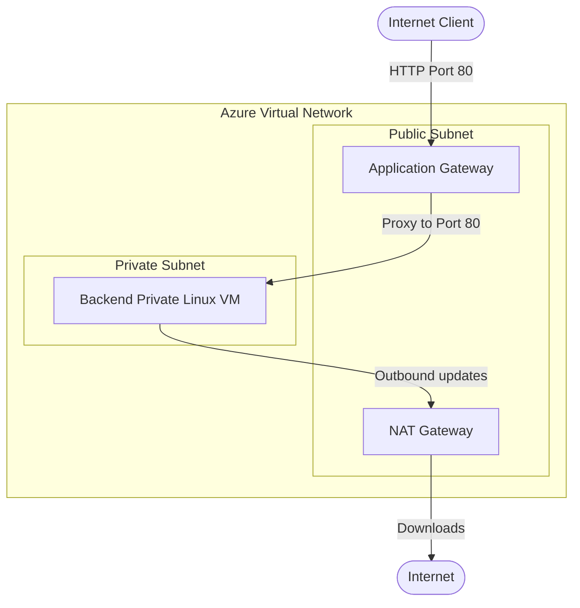

---

# DevOps Exam Project: Azure Infrastructure Automation

This repository contains the Terraform infrastructure code and GitHub Actions workflows for my DevOps exam project. It automatically provisions a secure, enterprise-style web environment on Azure.

## Architecture Explanation

Security and private networking were the primary focus for this build. Here is a breakdown of the design:

* Virtual Network (VNet): The environment runs inside a single VNet, which is logically divided into public and private subnets.
* Application Gateway: Instead of exposing the web server directly to the internet, I deployed an Azure Application Gateway (Standard_v2) in the public subnet. It acts as the sole entry point, handling all incoming HTTP traffic and providing Layer 7 load balancing.
* Backend VM: The application itself runs on an Ubuntu 22.04 LTS Gen2 virtual machine (Standard_D2s_v7). I placed this entirely within the private subnet without a public IP address, keeping it isolated from direct external access.
* NAT Gateway: Since the private VM still needs internet access to download Docker and system updates, I attached a NAT Gateway to the private subnet for secure outbound routing.
* Automated Bootstrapping: The VM configuration is completely hands-off. I used Azure's custom_data attribute to inject a cloud-init.yaml script. On first boot, the server automatically installs Docker, pulls the application container, and sets up port 80 proxying.

### Architecture Diagram



## Azure Authentication Configuration

To avoid the risks of managing long-lived client secrets, this project uses OpenID Connect (OIDC) for secretless authentication.

I configured Federated Identity Credentials in Azure Entra ID and linked it to this specific GitHub repository. When the GitHub Actions pipeline runs, it requests a temporary, short-lived token from GitHub. Azure verifies this token dynamically. In the Terraform code, this is enabled simply by adding "use_oidc = true" to the azurerm provider and backend blocks.

## Remote Backend and State Locking

To manage the infrastructure state securely, I configured an Azure Blob Storage container (crescendotfstate / tfstate) as the remote backend.

* Centralized State: The state file is encrypted at rest and accessible to the CI/CD pipeline, rather than sitting locally on a developer's machine.
* State Locking: Azure Blob Storage handles state locking natively using blob leasing. Whenever Terraform runs a plan or apply, it places a lease on the state blob. This prevents concurrent pipeline runs from accidentally overwriting or corrupting the infrastructure state.

## Required GitHub Secrets and Variables

Because the project uses OIDC, there are no passwords or secrets to configure. You only need to set up three standard Repository Variables in GitHub (under Settings > Secrets and variables > Actions > Variables):

* AZURE_CLIENT_ID: Your Azure App Registration Client ID.
* AZURE_TENANT_ID: Your Azure Active Directory Tenant ID.
* AZURE_SUBSCRIPTION_ID: Your Azure Subscription ID.

## How to Run the Terraform Code

### Method 1: GitHub Actions (Automated)

This repository includes a complete CI/CD setup.

1. Any code pushed to the "main" branch will automatically trigger the Terraform Plan & Apply workflow.
2. To tear down the infrastructure and stop billing, navigate to the GitHub Actions tab and manually run the Terraform Destroy workflow.

### Method 2: Local Execution

If you have the Azure CLI installed and are authenticated via "az login", you can run the deployment from your terminal:

```bash
# 1. Initialize the backend and providers
terraform init

# 2. Review the execution plan
terraform plan

# 3. Provision the infrastructure
terraform apply -auto-approve

# 4. Tear down the infrastructure when finished
terraform destroy -auto-approve

```

## Assumptions Made

1. Pre-existing Storage: I assumed the resource group (tfstate-rg) and storage account (crescendotfstate) used for the remote backend were already provisioned before running the pipeline.
2. Domain & SSL: Since a custom domain name was not an exam requirement, the Application Gateway listens on HTTP (Port 80) using an Azure-generated Public IP.
3. SSH Access: Terraform dynamically generates an SSH key pair for the VM to satisfy Azure's provisioning requirements. However, manual SSH access isn't actually needed since cloud-init handles the server configuration automatically.

## Known Limitations and Challenges

1. Student Subscription Quotas: Azure for Students has strict regional compute limitations. I originally attempted to deploy standard B-series VMs in East US and Southeast Asia but was repeatedly blocked by "SkuNotAvailable" capacity errors. To get around this, I queried available quotas via the CLI and moved the deployment to Central US using a Gen2 Standard_D2s_v7 VM.
2. Azure Front Door Restrictions: The original design included Azure Front Door, but free and student subscriptions do not have permissions to provision it. Application Gateway was used as the alternative for Layer 7 load balancing.
3. Single Compute Node: To conserve student credits, the backend compute tier is a single Virtual Machine rather than a Virtual Machine Scale Set (VMSS). The network infrastructure is highly available, but the compute layer relies on a single node.